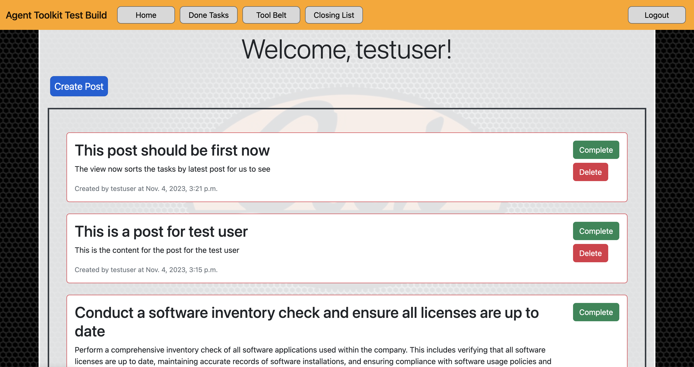
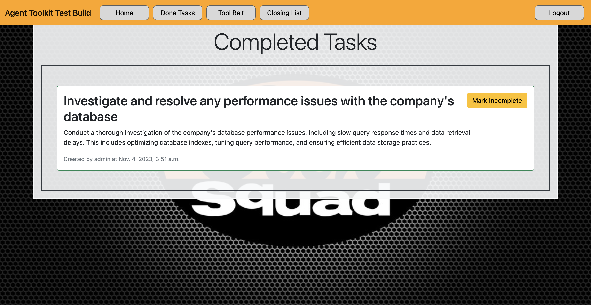
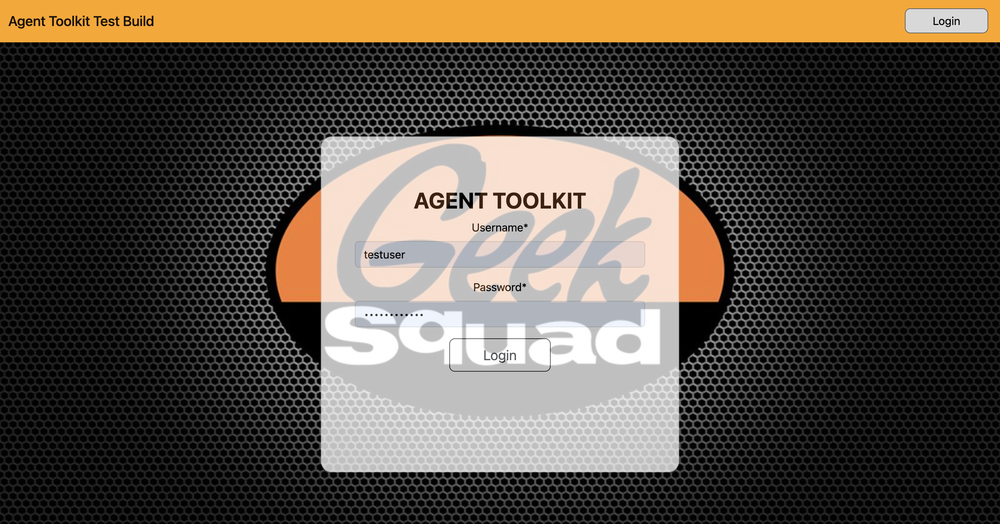

# Agent Toolkit (ATK)

Agent Toolkit (ATK) is a web-based toolbox designed for the Geek Squad, enabling them to create drives and download front desk software efficiently.







## Installation

Use the package manager [pip](https://pip.pypa.io/en/stable/) to install the required dependencies.

```bash
pip install django
pip install djangorestframework
pip install django-crispy-forms
pip install crispy-bootstrap5
pip install psycopg2-binary
pip install psycopg
```

## Description

ATK is built using Django, a high-level Python web framework that encourages rapid development and clean, pragmatic design. The tool is integrated with various modules and functionalities, including user authentication, forum post creation, and deletion. Users with staff privileges can manage posts effectively. Additionally, ATK leverages React for component support, although the integration of React has not been extensively utilized yet. The combination of Django's backend capabilities with React's frontend component-based architecture provides ATK with a strong foundation for creating a robust and interactive web application.

## Features
User authentication and authorization
Admins can delete any post
Users who create a post can delete their own post
Any user can create a forum post
Descriptive post information for moderation purposes

## Basic Usage
After installing the required dependencies, navigate to the directory with ```manage.py``` to create a super user. (For security not anyone can sign up)

Execute the following command and follow the prompts:

```bash
python manage.py createsuperuser
```

Once you create your super user, run the ATK application by executing the following command:

```bash
python manage.py runserver
```

Once the server is running, you can access the ATK application by visiting the following URL in your web browser (log in with your super user):

```
http://127.0.0.1:8000/
```

## Creating Users

As mentioned for security reasons a staff member must request access to the ATK in person.

Navigate to the url below in order to access the admin panel (log in with your super user account)

```
http://127.0.0.1:8000/admin
```

From this panel you can add users and manage their permisions thanks to Djangos built in User system!


## License
This project is licensed under the MIT license.
